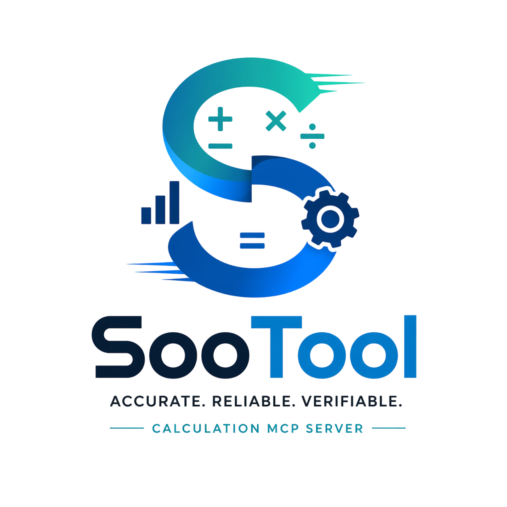

<p align="center">
  
</p>

# SooTool
Precision Calc MCP for LLM tool use.

<!-- mcp-name: io.github.JinHo-von-Choi/sootool -->

[](https://github.com/JinHo-von-Choi/SooTool/actions/workflows/ci.yml)
[](https://pypi.org/project/sootool/)
[](https://www.python.org/downloads/)
[](LICENSE)

LLM 대신 계산을 맡는 MCP 서버. 세금, 급여, 금융, 통계, 공학 계산을 Decimal로 정확하게 수행하고 계산 근거를 함께 돌려준다. 18개 계산 도메인 275개 기본 도구 + 10개 admin 정책 도구, 한 번에 최대 500건 병렬 계산(`core.batch`), 단계 연결 계산(`core.pipeline`), 4종 전송(stdio/Streamable HTTP/Unix, 폐기 예정 SSE)을 제공한다. Python 3.12 이상.

## 왜 필요한가

LLM은 숫자를 계산하지 않고 그럴듯한 숫자를 생성한다. 그래서 누진세 구간 경계, 반올림 방향, 연도별 세율에서 자주 틀린다. 아래는 같은 20문제를 풀린 결과다(2026-04-24 측정).

|풀이 주체|정답(exact)|근사(오차 0.01% 이내)|오답|
|-|-|-|-|
|SooTool|**20**|0|0|
|gemini-3-pro-preview|12|4|4|
|claude-opus-4-7|9|3|8|
|gpt-5.4|5|3|12|

틀리는 지점은 모델이 달라도 비슷하다. 소득세 구간 경계, 양도소득세 장기보유특별공제, 부가세 반올림, 교류 임피던스 정밀도다. 문제 구성과 원자료는 [`bench/`](bench/README.md)에 있다.

SooTool은 이 계산을 세 가지 장치로 고정한다.

- **Decimal 전용 계산.** 입력 숫자는 문자열이나 Decimal로 받는다. 부동소수점 오차가 계산에 끼지 않는다.
- **법령 값의 외부화.** 세율, 공제액, 보험료율은 정책 파일(YAML)에 근거 조문과 시행일을 붙여 둔다. 시점(`as_of`)을 주면 그날 시행 중이던 값으로 계산한다.
- **계산 근거 반환.** 모든 응답에 공식, 입력, 중간값, 결과가 담긴 `trace`와 재실행 검증용 영수증(`_meta.integrity`)이 붙는다.

## 구조

```
 LLM 에이전트 / CLI / 파이썬 코드
        │
        │  MCP(stdio, HTTP, Unix)        sootool call ...        from sootool.sdk import tax
        ▼                                      ▼                          ▼
 ┌──────────────────────────────────────────────────────────────────────────────┐
 │ 경계 검사   인자 이름·타입·크기 검증, 숫자 문자열 → Decimal, 인증 범위 확인     │
 ├──────────────────────────────────────────────────────────────────────────────┤
 │ 레지스트리   도구 285개를 이름으로 찾아 실행 (core.batch / core.pipeline 포함)   │
 ├───────────────────────────────┬──────────────────────────────────────────────┤
 │ 도메인 도구                     │ 정책 로더                                      │
 │ tax · payroll · finance ·      │ policies/<도메인>/<이름>_<연도>.yaml           │
 │ realestate · stats · ...       │ 해시 검증 → as_of 시점의 시행 버전 선택         │
 └───────────────────────────────┴──────────────────────────────────────────────┘
        │
        ▼
 { 결과 필드, trace(공식·입력·단계·출력), 정책 출처와 근거 조문, _meta.integrity(영수증) }
```

세 진입점(MCP, CLI, SDK)은 같은 레지스트리를 거친다. 같은 입력이면 어느 경로로 불러도 결과와 영수증이 같다.

## 빠른 시작

### 설치

```bash
pip install sootool                 # 기호 계산(symbolic.*)까지 쓰려면 pip install "sootool[symbolic]"
```

### Claude Code에 등록

```bash
claude mcp add --scope user sootool -- uvx sootool
```

저장소를 받아 개발 중인 코드로 띄우려면 다음처럼 등록한다.

```bash
git clone https://github.com/JinHo-von-Choi/SooTool.git
cd SooTool && uv sync
claude mcp add --scope user sootool -- uv run --directory "$PWD" python -m sootool
```

### 첫 계산

MCP 클라이언트에서 "과세표준 5천만 원의 2026년 소득세는?"이라고 물으면 에이전트가 `tax.kr_income`을 호출한다. 터미널에서 같은 도구를 직접 실행할 수도 있다.

```bash
sootool call tax.kr_income --arg taxable_income=50000000 --arg year=2026 --format raw
```

```json
{
  "tax": "6240000",
  "effective_rate": "0.12480000",
  "marginal_rate": "0.15",
  "breakdown": [ ... 구간별 과세표준과 세액 ... ],
  "policy_effective_date": "2026-01-01",
  "policy_citations": [{"law": "소득세법", "article": "제55조제1항", "url": "https://www.law.go.kr/법령/소득세법/제55조"}]
}
```

## 응답 읽는 법

`finance.npv(rate="0.08", cashflows=["-1000","300","400","500","200"], rounding="HALF_EVEN", decimals=2)`의 실제 응답이다.

```json
{
  "npv": "164.64",
  "trace": {
    "tool": "finance.npv",
    "formula": "NPV = sum(CF_t / (1+r)^t, t=0..n)",
    "inputs": {"rate": "0.08", "cashflows": ["-1000", "300", "400", "500", "200"], "rounding": "HALF_EVEN", "decimals": 2},
    "steps": [{"label": "npv_raw", "value": "164.63539696786661172171511042618089308126395968697"}],
    "output": "164.64"
  },
  "_meta": {
    "integrity": {
      "tool": "finance.npv",
      "input_hash": "00da5199...",
      "result_hash": "d7a0ecfe...",
      "tool_version": "1.0.0",
      "sootool_version": "0.2.0"
    },
    "engine": "decimal"
  }
}
```

|필드|뜻|
|-|-|
|`npv` 등 결과 필드|계산 결과. 숫자는 모두 문자열이다.|
|`trace.steps`|반올림 전 값을 포함한 중간 계산. 결과를 사람이 검산할 때 본다.|
|`policy_*`|정책 도구만 붙는다. 적용한 정책 파일의 시행일, 상태, 근거 조문, 해시.|
|`_meta.integrity`|영수증. 입력과 결과의 해시라서 `sootool receipt verify`로 같은 계산을 다시 돌려 대조할 수 있다.|
|`_meta.engine`|계산 엔진. `decimal`(정확), `mpmath`(지정 자릿수), `float64`(근사), `composite`, `none`.|
|`_meta.hints`|다음에 부를 만한 도구 제안. 결과 값에는 영향이 없다.|

## 주요 기능

### 반올림은 호출자가 고른다

반올림 관행이 상황마다 갈리는 금융·회계 도구(부가세, 현금흐름, 감가상각, 환전 등)는 `rounding`(HALF_EVEN, HALF_UP, DOWN, UP, FLOOR, CEIL)과 `decimals`를 받는다. 부가세 역산은 원 단위 절사(DOWN), 회계 일반은 HALF_EVEN처럼 쓰임새마다 규칙이 다르기 때문이다. 법령이 끝수 처리를 정한 세목(예: 지방세 10원 미만 절사)은 그 규칙을 그대로 따르고 도구 설명에 적어 둔다.

### 시점을 지정한 정책 계산

세법과 보험료율은 연중에도 바뀐다. 정책 도구는 `year` 외에 `as_of`(YYYY-MM-DD)와 `include_proposed`를 받는다.

```
policies/payroll/kr_4insurance_2026.yaml             2026-01-01 ~ 2026-06-30
policies/payroll/kr_4insurance_2026@2026-07-01.yaml  2026-07-01 ~ 2026-10-31  ◀── as_of="2026-08-15"
policies/payroll/kr_4insurance_2026@2026-11-01.yaml  2026-11-01 ~ 2026-12-31

as_of가 속한 버전으로 계산하고, 응답에 그 버전의 시행일과 근거 조문을 싣는다.
```

`as_of`를 주지 않으면 그 해 확정 버전 중 시행일이 가장 늦은 것을 쓴다. 국회 확정 전 개정안(`status: proposed`)은 `include_proposed=true`일 때만 쓴다. 정책 파일을 서버 재배포 없이 고치는 절차는 [docs/policy_management.md](docs/policy_management.md)에 있다.

### 여러 건을 한 번에: batch와 pipeline

```
core.batch     독립 계산 N건을 병렬로             core.pipeline   앞 단계 결과를 다음 단계 입력으로
                                                 
 ┌ s1: finance.npv(rate=0.05) ┐                  annual = core.mul(3000000, 12)
 ├ s2: finance.npv(rate=0.08) ┼─▶ id 순서로 결과       │  ${annual.result.result}
 └ s3: finance.npv(rate=0.10) ┘                       ▼
                                                  tax = tax.kr_income(annual, 2026)
 최대 500건, 항목당 10초, 전체 60초              최대 50단계, 깊이 10, 단계당 2초, 전체 30초
```

`core.batch`는 항목마다 성공, 오류, 시간 초과를 따로 기록하고 결과를 입력 순서대로 돌려준다. `core.pipeline`은 앞 단계가 실패하면 뒤 단계를 `skipped`로 표시하며, 실패한 지점부터 다시 돌리는 `core.pipeline_resume`(10분 보관)이 있다.

```json
{
  "name": "core.pipeline",
  "arguments": {
    "steps": [
      {"id": "annual", "tool": "core.mul",      "args": {"operands": ["3000000", "12"]}},
      {"id": "tax",    "tool": "tax.kr_income", "args": {"taxable_income": "${annual.result.result}", "year": 2026}}
    ]
  }
}
```

실무에서는 다음처럼 쓴다.

|작업|규모|조합|
|-|-|-|
|급여 마감|직원 500명|`core.batch` + `payroll.kr_salary`|
|투자 민감도|할인율 9개 × 현금흐름 5안|`core.batch` + `finance.npv`, `finance.irr`|
|거래명세서 부가세 분리|수백 건|`core.batch` + `accounting.vat_extract`|
|월급에서 실수령액까지|4단계|`core.pipeline`|

### 역산, 비교, 설명

- `core.solve_for`: 목표 결과를 만드는 입력값을 찾는다. 예) 실수령액 300만 원이 되는 세전 월급.
- `core.compare`: 기준안 대비 시나리오별 값과 차이를 표로 낸다.
- `core.explain`: 계산 과정과 적용 정책을 한국어나 영어 문장으로 풀어 쓴다. 수치는 바꾸지 않는다.

### 영수증 재실행 검증

```bash
sootool receipt verify --tool finance.fv \
  --arguments '{"present_value":"1000","rate":"0.05","periods":10}' \
  --receipt receipt.json
```

같은 도구를 다시 실행해 도구 이름, 입력 해시, 결과 해시, 도구 버전, 정책 해시를 대조한다. `SOOTOOL_RECEIPT_KEY_FILE`에 ed25519 개인 키 파일을 지정하면 영수증에 서명이 붙는다.

## 도구 카탈로그 (275개 기본 + 10개 admin, 18 계산 도메인 + 운영 도구)

|Namespace|Count|대표 도구|
|-|-|-|
|core|11|add, sub, mul, div, calc(수식), batch, pipeline, pipeline_resume, solve_for, compare, explain|
|accounting|11|vat_extract, vat_add, balance, 감가상각 3종, dupont 2종, ratios, income_statement, cashflow_operating|
|finance|18|pv, fv, npv, irr, roi, cagr, payback_period, loan_schedule, bond_ytm, bond_duration, black_scholes, var 2종, sharpe, sortino|
|tax|17|kr_income, kr_comprehensive_income_tax, kr_withholding_simple, capital_gains_kr, kr_gift, kr_inheritance, kr_corporate, kr_eitc, 지방세 부가 3종|
|tax_us|4|federal_income, capital_gains, state_tax, fica|
|payroll|15|kr_salary, kr_gross_from_net, kr_severance_pay, kr_year_end_tax_settlement, kr_overtime_pay, kr_minimum_wage_check, 공제 4종|
|realestate|10|kr_acquisition_tax, kr_transfer_tax, kr_property_tax, kr_comprehensive, kr_ltv, kr_dti, kr_dsr, kr_subscription_score|
|stats|14|descriptive, t-검정 3종, anova_oneway, regression_linear, ci_mean, bootstrap_ci, 비모수 검정|
|probability|30|정규, 이항, 포아송, 감마, 베타, 지수, 로그정규, 카이제곱, F 분포의 pdf·cdf·ppf, bayes, nCr, nPr|
|datetime|14|영업일 계산, day_count, age, diff, tz_convert, 음양력 변환, 24절기, 회계연도, 소득세 과세기간|
|math|10|수치 적분 2종, 수치 미분 2종, 보간 2종, polynomial_roots, polynomial_horner, fft, ifft|
|geometry|15|넓이·부피 7종, 벡터 3종, 행렬 4종, haversine|
|engineering|56|전기·교류 회로, 유체, 열전달, 재료역학, 제어, 신뢰성, SI 접두어 변환|
|units|8|convert, fx_convert, fx_triangulate, temperature, 에너지·압력·데이터 크기·시간 변환|
|medical|12|bmi, bsa, egfr, dose_weight_based, pregnancy_weeks, cha2ds2_vasc, has_bled, framingham_cvd_10y, QTc 4종|
|science|11|half_life, ideal_gas, molar_mass, stoichiometry, nernst, snell_law, thin_lens, bragg 외|
|crypto|10|gcd, lcm, egcd, modinv, modpow, crt, is_prime, euler_totient, carmichael_lambda, hash|
|pm|5|critical_path, pert, evm, earned_schedule, monte_carlo_schedule|
|symbolic|2|solve, diff (`sootool[symbolic]` 설치 시)|
|sootool|2+10|skill_guide, verify_receipt, 정책 관리 10종(쓰기 4종은 관리자 모드)|

도구별 버전, 정확도 등급, 설명은 [docs/tool_catalog.md](docs/tool_catalog.md)에 있다. 이 파일은 레지스트리에서 자동 생성한다.

## 서버 실행

```bash
sootool                                                    # stdio (MCP 클라이언트 기본)
sootool --transport http --http-port 10535                 # Streamable HTTP
sootool --transport unix --socket /tmp/sootool.sock        # Unix 소켓
sootool --transport stdio,http --socket /tmp/sootool.sock  # 여러 전송 동시 기동
```

|전송|용도|비고|
|-|-|-|
|stdio|Claude Code, Claude Desktop 등 로컬 클라이언트|기본값|
|http|원격 접속(Streamable HTTP)|무상태라 로드 밸런서 뒤에 둘 수 있다. 기본 포트 10535|
|unix|같은 호스트의 다른 프로세스|소켓 파일 권한(기본 0600)으로 접근을 통제한다|
|sse-legacy|MCP 2024-11 클라이언트 호환|폐기 예정. `--enable-sse-legacy`로만 켜진다. 기본 포트 10536|

네트워크 전송의 보안 규칙은 다음과 같다.

- 기본 바인딩은 `127.0.0.1`이다. `--host 0.0.0.0`으로 외부에 열려면 `--auth-token`(또는 `SOOTOOL_AUTH_TOKEN`)이 있어야 기동한다.
- 정책을 바꾸는 쓰기 도구 4종은 stdio와 Unix 소켓에서만 노출한다. 네트워크에서 쓰려면 `--admin --remote-admin --admin-token <토큰>`이 모두 필요하고, 관리자 토큰으로 인증한 요청만 쓰기를 수행한다.

### 노출 프로파일

```bash
sootool --profile full   # 기본값. 도구 285개를 모두 노출
sootool --profile lean   # sootool.search, describe, call, skill_guide 4개만 노출
```

`lean`은 도구 정의 전체를 컨텍스트에 올리지 않는다. 에이전트는 `sootool.search`로 도구를 찾고, `sootool.describe`로 인자를 확인한 뒤, `sootool.call`로 실행한다. 결과와 영수증은 직접 호출과 같다. `sootool.call`은 읽기 전용 도구만 실행한다.

## 명령줄

서브커맨드를 주면 서버를 띄우지 않고 도구를 바로 실행한다.

```bash
sootool call core.add --arg 'operands=["1.5","2.5"]'
sootool call finance.npv --arg-json '{"rate":"0.1","cashflows":["-100","50","60","70"]}'
sootool call payroll.kr_gross_from_net --arg net_monthly=3000000 --arg year=2026 --format raw
sootool tools list --search 양도세        # 줄임말과 일상 표현으로 검색
sootool tools describe tax.kr_income     # 인자와 정책 인자 확인
sootool batch -f items.json              # -f - 는 표준입력
sootool policy show --arg domain=tax --arg name=kr_income --arg year=2026
sootool skill-guide --section triggers
sootool version
```

|항목|내용|
|-|-|
|인자|`--arg 이름=값`을 반복하거나 `--arg-json`으로 한 번에 넘긴다. 문자열 인자는 값을 그대로 쓰고, 정수·불리언·목록·객체는 JSON으로 읽는다.|
|출력 형식|`--format pretty`(기본), `json`(전체), `raw`(trace와 `_meta` 제외), `trace`|
|출력 위치|결과는 표준출력, 오류는 표준에러에 JSON으로 낸다.|
|종료 코드|0 성공, 1 도구 오류, 2 입력 오류, 3 관리자 모드 필요(`SOOTOOL_ADMIN_MODE=1`), 70 내부 오류|

## 파이썬 라이브러리로 쓰기

MCP 서버 없이 같은 도구를 함수로 부른다. 결과, 영수증, `as_of` 처리가 MCP와 같고 결과 타입이 선언되어 있어 타입 검사기가 필드를 확인한다.

```python
from sootool.sdk import tax

out = tax.kr_income(taxable_income=50_000_000, year=2026)
out["tax"]                                # "6240000"
out["_meta"]["integrity"]["input_hash"]   # 재실행 검증용 영수증
```

샌드박스에서 에이전트가 파이썬을 실행하는 구성은 [docs/sdk.md](docs/sdk.md)를 본다.

## 에이전트에 사용 규칙 알려 주기

도구를 등록해도 에이전트가 직접 암산하는 경우가 있다. 아래 중 하나로 "숫자 계산은 SooTool로" 규칙을 넣는다.

- 세션 시작 시 `sootool.skill_guide`를 호출하게 한다. 언제 어떤 도구를 부를지 정리한 트리거 표, 예시, 금지 패턴, 플레이북을 돌려준다(`section`: `triggers`, `examples`, `anti_patterns`, `playbooks`, `all` / `lang`: `ko`, `en`).
- 클라이언트 설정 파일에 붙여 넣을 규칙: [Claude Code](docs/integration/claude-md-snippet.md), [Cursor](docs/integration/cursor-rules-snippet.md), [AGENTS.md](docs/integration/agents-md-snippet.md)

## 문서

|문서|내용|
|-|-|
|[사용자 가이드](docs/user_guide.md)|도메인별 도구 개요, 공통 인자, 응답 규칙|
|[도구 카탈로그](docs/tool_catalog.md)|도구 285개의 버전, 정확도 등급, 설명|
|[정책 관리](docs/policy_management.md)|정책 파일 구조, 시점 선택, 갱신·롤백 절차, 감사 로그|
|[SDK](docs/sdk.md)|파이썬 라이브러리 사용법과 샌드박스 구성|
|[외부 정책 팩](docs/external_policy_packs.md)|서명된 정책 묶음의 생성, 검증, 설치|
|[안정성 계약](docs/stability.md)|호환을 약속하는 범위와 폐기 절차|
|[쿡북](docs/cookbook/)|세무, 금융, 전기 공학 시나리오별 호출 예시|
|[아키텍처 결정 기록](docs/architecture.md)|설계 결정과 근거(ADR)|
|[릴리스 절차](docs/release.md)|버전 올리기부터 PyPI 게시까지|

## 개발

```bash
uv sync --extra symbolic
make test        # pytest와 커버리지
make lint        # ruff
make typecheck   # mypy
uv run python scripts/mcp_smoke_test.py   # stdio 연결 점검 (http, sse, unix 스크립트도 있다)
```

새 도구는 `src/sootool/modules/<도메인>/`에 함수를 만들고 `@REGISTRY.tool(namespace, name, description, version)`을 붙인 뒤 도메인 `__init__.py`에서 불러오면 등록된다. 도구 설명이나 타입을 바꾸면 `scripts/gen_tool_catalog.py`와 `scripts/gen_sdk_stubs.py`로 생성 문서를 다시 만든다. 정책 파일을 고치면 `scripts/policy_stamp.py`로 해시를 갱신한다.

## 라이선스

MIT. [LICENSE](LICENSE) 참조.
